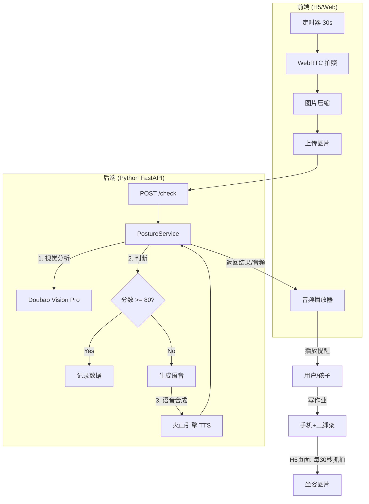

<<<<<<< HEAD
# 智能坐姿守护助手 (Posture Guardian)

一部手机 + 一个三脚架，就能让孩子自己主动注意坐姿。

## 项目背景

家长无法时刻盯着孩子写作业，且频繁的口头提醒容易引发亲子矛盾。本项目利用 **手机浏览器 + AI 大模型**，实现低成本、自动化的坐姿检测：

- 每 **30 秒** 自动抓拍一次
- 调用 **豆包视觉大模型** 分析坐姿
- 不合格时通过 **语音合成** 温柔提醒
- 合格时静默，不打扰孩子专注

## 系统架构



## 功能特性

| 功能 | 说明 |
|------|------|
| 定时抓拍 | 每 30 秒自动拍照，可手动调整间隔 |
| 坐姿评分 | 0-100 分，≥80 分为合格 |
| 问题识别 | 识别驼背、眼睛太近、歪头等问题 |
| 语音提醒 | 温柔女声，针对具体问题给出建议 |
| 历史记录 | 查看检测日志和得分趋势 |

## 快速开始

### 1. 环境准备

确保已安装 Python 3.8+，然后安装依赖：

```bash
pip install -r requirements.txt
```

### 2. 配置 API 密钥

复制环境变量模板并填入你的密钥：

```bash
cp env.example .env
```

编辑 `.env` 文件：

```ini
# 火山引擎方舟 (Doubao Vision) 配置
# 获取地址: https://console.volcengine.com/ark/region:ark+cn-beijing/apiKey
ARK_API_KEY=你的ApiKey
ARK_MODEL_NAME=doubao-seed-1-6-vision-250815

# 火山引擎语音合成 (TTS) 配置
# 获取地址: https://console.volcengine.com/speech/service/8
TTS_API_KEY=你的TTS ApiKey
TTS_SPEAKER=zh_male_beijingxiaoye_emo_v2_mars_bigtts
```

### 3. 启动服务

```bash
python main.py
```

或使用 uvicorn：

```bash
uvicorn main:app --reload --host 0.0.0.0 --port 8000
```

### 4. 访问应用

打开浏览器访问 `http://localhost:8000`

> **提示**：在手机上使用时，需要通过 HTTPS 访问才能调用摄像头。本地开发时 localhost 不受此限制。

## API 接口

### POST /check

检测坐姿并返回评分结果。

**请求体：**

```json
{
    "image": "data:image/jpeg;base64,/9j/4AAQ..."
}
```

**响应：**

```json
{
    "score": 75,
    "is_qualified": false,
    "issues": ["背部前倾", "眼睛离书本太近"],
    "audio": "base64编码的MP3音频..."
}
```

| 字段 | 类型 | 说明 |
|------|------|------|
| score | int | 坐姿评分 (0-100) |
| is_qualified | bool | 是否合格 (≥80 为 true) |
| issues | array | 检测到的问题列表 |
| audio | string | Base64 编码的语音提醒 (合格时为 null) |

## 部署指南

### 部署到 Render (推荐)

1. 将代码推送到 GitHub
2. 在 [Render.com](https://render.com) 创建 Web Service
3. 连接你的 GitHub 仓库
4. 配置：
   - **Build Command**: `pip install -r requirements.txt`
   - **Start Command**: `uvicorn main:app --host 0.0.0.0 --port $PORT`
5. 在 Environment 中添加环境变量
6. 部署完成后获得 HTTPS 地址

### 部署到其他平台

本项目兼容任何支持 Python 的云平台，如：
- Vercel (需要适配)
- Railway
- 阿里云/腾讯云轻量服务器

## 使用建议

### 三脚架摆放

- 将手机放置在孩子 **左后方或右后方 30° 角**
- 确保能看到孩子的背部、头部和书桌
- 避免逆光，保证画面清晰

### 检测间隔

- 默认 **30 秒**检测一次
- 可在前端代码中修改 `CHECK_INTERVAL` 变量

### 日志记录

系统会自动保存每次检测的记录：

- **截图**: 保存在 `logs/images/` 目录，文件名格式：`YYYYMMDD_HHMMSS_毫秒.jpg`
- **API结果**: 保存在 `logs/results/` 目录，文件名格式：`YYYYMMDD_HHMMSS_毫秒.json`

每个 JSON 文件包含：
- 时间戳
- 图片文件名
- 完整的 API 返回结果

可通过 API 接口查看历史记录：
```bash
GET /api/records?date=2025-12-08&limit=100
```

## 项目结构

```
PostureGuardian/
├── main.py                 # 主入口文件，FastAPI 应用
├── config.py              # 配置文件，管理所有配置项
├── requirements.txt       # Python 依赖
├── env.example            # 环境变量模板
├── services/              # 服务模块
│   ├── vision_service.py  # 视觉分析服务
│   ├── tts_service.py    # 语音合成服务
│   └── logger_service.py # 日志记录服务
├── models/                # 数据模型
│   └── response_models.py # 响应数据模型
├── static/                # 静态文件
│   └── index.html        # 前端页面
└── logs/                  # 日志目录（自动创建）
    ├── images/           # 保存的截图
    └── results/          # 保存的API返回结果
```

## 技术栈

- **后端**: Python 3.8+ / FastAPI
- **前端**: HTML5 / CSS3 / JavaScript
- **视觉模型**: 火山引擎 Doubao Vision Pro
- **语音合成**: 火山引擎 TTS

## 隐私说明

- 图片仅用于 AI 实时分析，分析后不做其他用途
- 所有数据存储在本地浏览器中
- 不收集任何用户个人信息

## License

MIT License

>>>>>>> chore: initial upload
